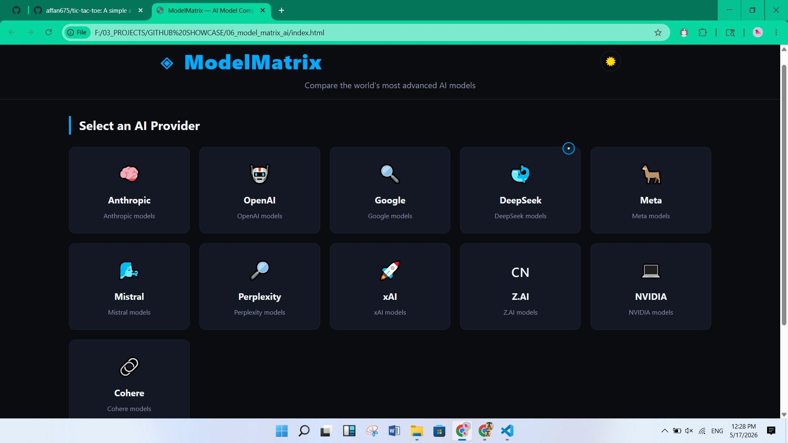
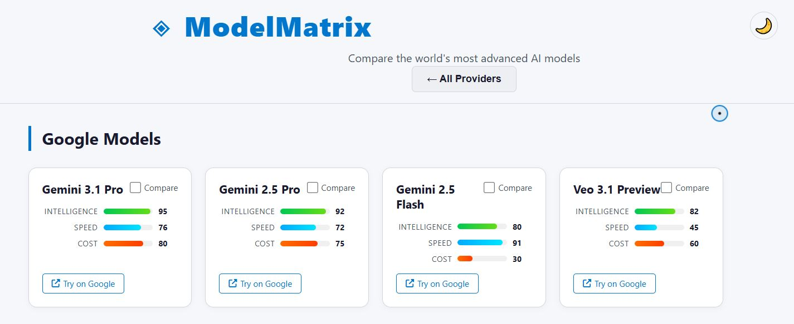
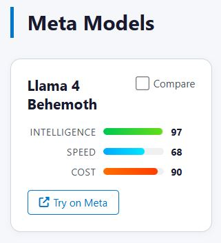

<p align="center">
  <h1>✨ Model Matrix AI</h1>
  <p>Visually compare, browse and inspect machine learning models — minimal, fast, and production-ready UI.</p>
  <p>
    
    
    
    
    
  </p>
</p>

---

## Short Description

Model Matrix AI is a sleek, static front-end for exploring and comparing machine learning models. It focuses on clarity, speed, and an attractive developer-friendly UI — perfect for portfolio demos and lightweight internal tools.

## Features

- Clean, responsive UI for browsing models
- Fast client-side interactions using vanilla JavaScript
- Lightweight assets and no build step (static site)
- Example model metadata and visual previews
- Easy to host (GitHub Pages / static server)

---

## Screenshots

Minimal gallery — click an image to view the full resolution.

<p align="center">
  <a href="assets/screenshots/home_page.JPG"></a>
  <a href="assets/screenshots/home_light.png"></a>
</p>

<p align="center">
  <a href="assets/screenshots/model_list.JPG"></a>
  <a href="assets/screenshots/meta_model.JPG"></a>
</p>

*Captions:* Home (dark), Home (light), Model list, Model details.

---

## Tech Stack

- HTML5
- CSS3
- JavaScript (vanilla)

Badges:

  

---

## Installation / Setup

This project is static — no install required. Two quick options to run locally:

```bash
# 1) Open directly in your browser
open index.html # or double-click the file in Explorer

# 2) Serve with Python (recommended for relative assets)
python -m http.server 8000
# Then open http://localhost:8000

# 3) Or use Node http-server
# npx http-server . -p 8000
```

---

## Usage

- Open `index.html` in a browser or serve the folder.
- Browse the model list, click an item to view metadata and preview.
- All data lives in the `js/` and `data.js` files for easy editing.

---

## Folder Structure

```
├─ index.html
├─ README.md
├─ css/
│  └─ style.css
├─ js/
│  ├─ main.js
│  ├─ data.js
│  ├─ compare.js
│  ├─ cursor.js
│  └─ preloader.js
└─ assets/
   └─ screenshots/
      ├─ home_page.JPG
      ├─ home_light.png
      ├─ model_list.JPG
      └─ meta_model.JPG
```

---

## Future Improvements

- Add search, filtering and sorting for large model catalogs
- Add lightweight persistence (localStorage) for user preferences
- Convert to a small SPA with routing for deeper interactions
- Add automated tests and CI for deploy previews

---

## Contributing

Contributions are welcome — open an issue or submit a PR. Keep changes small, add descriptive commit messages, and follow the existing style.

Tips:

- Fork the repo, create a feature branch, and open a PR.
- For visual changes, include before/after screenshots in the PR.

---

## Live Demo

Live demo: (coming soon) — deploy to GitHub Pages or a static host and replace the badge at the top.

---

## License

This project is open source under the MIT License. See `LICENSE` for details.

---

## Author

Made with ❤️ by Model Matrix contributors.
# ModelMatrix 🧠⚡

<div align="center">


**Compare the world's most advanced AI models side by side.**  
*Intelligence · Speed · Cost — at a glance.*

[🚀 Live Demo](#) (https://affan675.github.io/06_model_matrix_ai/git add) • [🐛 Report Bug](https://github.com/affan675/modelmatrix/issues) • [✨ Request Feature](https://github.com/yourusername/modelmatrix/issues)

</div>


---

## 🔥 Features

- 🧩 **30+ AI Models** from 11 major providers (Anthropic, OpenAI, Google, DeepSeek, Meta, Mistral, Perplexity, xAI, Z.AI, NVIDIA, Cohere)
- 📊 **Visual Performance Bars** – Intelligence (green), Speed (blue), Cost (red/orange) with numeric scores
- 🔄 **Model Comparison** – Select up to 4 models and open a detailed side‑by‑side modal with context window, price, and release date
- 🌐 **Direct Chat Links** – “Try on Provider” button opens the official AI chat in a new tab
- 🎨 **Dark & Light Themes** – One‑click toggle, respects system preference (saved to `localStorage`)
- 🖱️ **Custom Neon Cursor** – Glowing circle with a centered dot; expands on interactive elements (disabled on touch devices)
- ⚡ **Futuristic Preloader** – Full‑screen animation with progress bar and dynamic “neural cluster” messages
- 📱 **Fully Responsive** – Desktop, tablet, mobile (375px+)
- 🧪 **Zero Dependencies** – Pure HTML, CSS, and vanilla JavaScript (optional FontAwesome CDN for icons)

---

## 📦 Tech Stack

| Layer        | Technology                  |
|--------------|-----------------------------|
| Structure    | HTML5                       |
| Styling      | CSS3 (Custom Properties, Grid, Flexbox) |
| Logic        | Vanilla JavaScript (ES6+)   |
| Icons        | FontAwesome 6 (optional) + Emoji fallback |
| Fonts        | System UI font stack        |
| Extras       | `localStorage` for theme persistence |

No frameworks, no build tools — just open `index.html` and you’re ready.

---

## 🚀 Getting Started

### 1. Clone or Download

```bash
git clone https://github.com/yourusername/modelmatrix.git
cd modelmatrix
Or simply download the ZIP and extract.

2. Folder Structure
modelmatrix/
├── index.html
├── css/
│   └── style.css
├── js/
│   ├── data.js
│   ├── preloader.js
│   ├── cursor.js
│   ├── main.js
│   └── compare.js
├── screenshots/          (add your own)
└── README.md
```
3. Launch
Open index.html in any modern browser (Chrome, Firefox, Edge).
For the best experience, run it via a local server (e.g., Live Server in VS Code) to avoid CORS restrictions on FontAwesome (optional).

🧠 How It Works
Choose a provider – Click on a provider card (Anthropic, OpenAI, etc.) to see their models.

Explore models – Each card shows three colored bars and a “Compare” checkbox.

Compare – Check up to 4 models. A bottom bar appears with your selection. Click “Compare Selected” to open the comparison modal.

Try them – Use the “Try on Provider” link to jump directly into the official AI chat.

Toggle theme – Click the sun/moon button in the header to switch between dark and light.

All data is stored in js/data.js. You can easily add, remove, or update models.

```
🎨 Color Palette
Role	Dark Mode	Light Mode
Background	#0A0C10	#F5F7FA
Surface / Cards	#141824	#FFFFFF
Borders	#1E2433	#D0D7DE
Primary Accent	#00AAFF	#0077CC
Gold (hover)	#FFD700	#D4A017
Text Primary	#F0F3F8	#1A1A2E
Text Secondary	#8B93A7	#4B5563

📊 Model Data Schema
Each model object in js/data.js:

javascript (All datas are from the officail website)
{
  name: "Claude Opus 4.7",
  provider: "Anthropic",
  intelligence: 96,   // 0-100
  speed: 72,
  cost: 88,           // higher = more expensive
  context: "200K tokens",
  release: "Apr 2026",
  priceInput: "$15.00 / 1M tokens",
  url: "https://claude.ai/new"
}
```
```
📁 File Descriptions
File	Lines	Purpose
index.html	~140	Main structure, preloader, modals, script/css links
css/style.css	~350	All styling, responsive rules, theme, cursor, animations
js/data.js	~180	Complete dataset of 30+ AI models
js/preloader.js	~50	Preloader animation with random messages
js/cursor.js	~55	Custom neon cursor and touch detection
js/main.js	~160	Provider cards, model cards, filtering, selection, theme toggle
js/compare.js	~90	Comparison modal, side‑by‑side display, clear logic
All files are well‑commented and follow modern best practices.
```

🌟 Contributing
Contributions are welcome!
Feel free to open an issue or submit a pull request. Please keep the zero‑dependency approach. I would be very happy if you contribute.

Ideas for future enhancements (You can Contribute):

✅ Add more models / providers

✅ Radar chart comparison

✅ Search / filter by model name

✅ Export comparison as image

📄 License
This project is open source under the MIT License.
You’re free to use, modify, and distribute it.

🙏 Acknowledgements
Model data curated manually from official provider announcements. I want contribution for new models input and new versions.

Icons by FontAwesome.

Emoji icons from the Unicode standard.

``` 
Built with passion for the AI community. By Affan Adil 🚀